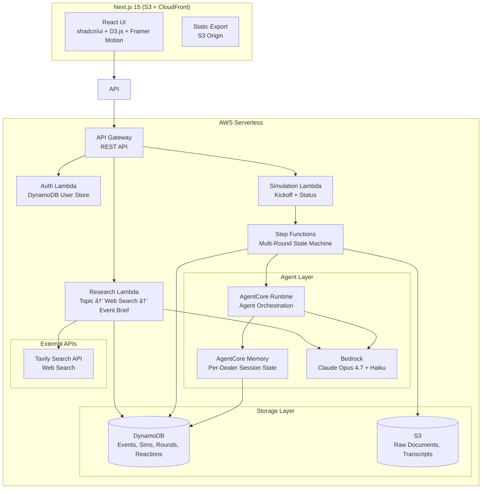
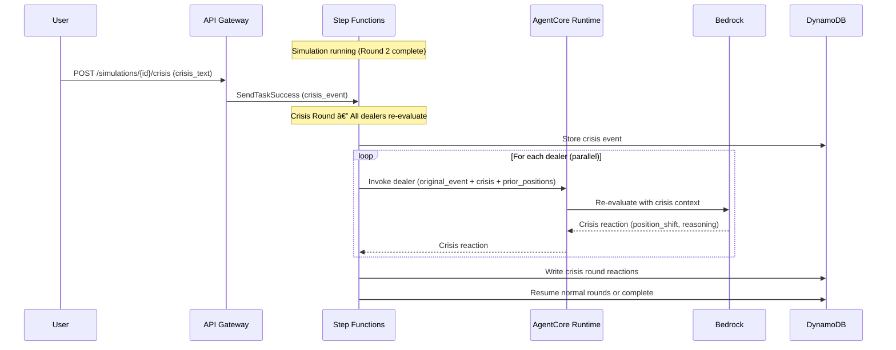
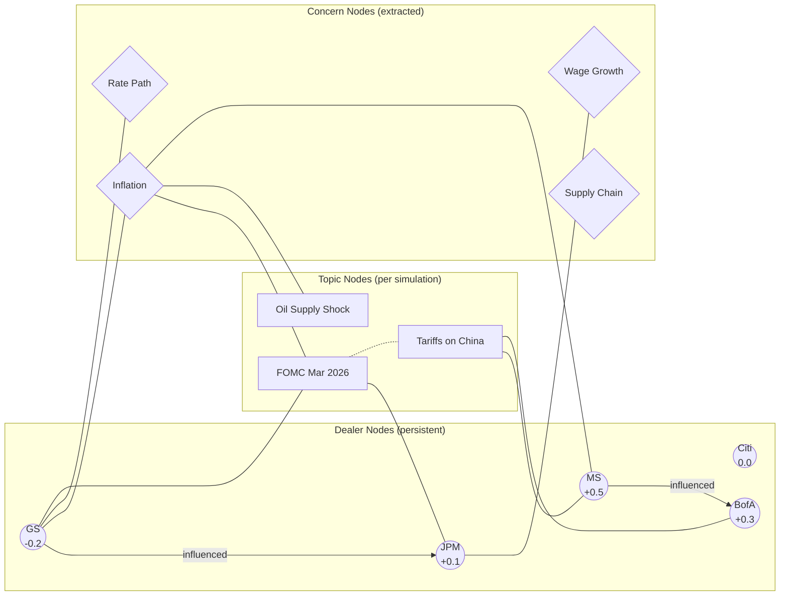

# Design Document: MarketSounding Hackathon — MiroFish-Style Multi-Round Dealer Simulator

## Overview

MarketSounding is a multi-agent market reaction simulator that models how primary dealers respond to market events through a MiroFish-style multi-round "roundtable" interaction. Unlike the original single-pass design, dealers see each other's initial reactions and iteratively update their views across 3–5 rounds, forming opinion clusters and revealing consensus/dissent dynamics — mirroring how real dealer desks influence each other through public commentary.

**Event sourcing is topic-driven**: users type a topic (e.g., "tariffs on China", "FOMC June decision", "oil supply shock") and the system searches the web for the latest relevant news, synthesizes findings into a coherent event brief with source citations, then feeds it into the multi-round roundtable. Users can also paste raw text or select from sample events.

The system is deployed as a fully serverless AWS stack (Lambda + Step Functions + API Gateway + DynamoDB + S3 + CloudFront) managed via Terraform, with a Next.js 15 frontend statically exported to S3 and served via CloudFront. Claude Opus 4.7 via Amazon Bedrock provides primary reasoning for dealer personas, while Haiku handles utility tasks (summarization, search query generation, event classification). AWS Bedrock AgentCore provides per-dealer session memory across rounds and agent orchestration.

The key innovation over the original hackathon design: dealers don't just react in isolation — they see the room, respond to each other, shift positions, and form clusters. Crisis injection mid-simulation forces re-evaluation, producing a rich transcript of evolving market views.

## Architecture



## Sequence Diagrams

### Main Simulation Flow (Multi-Round)

```mermaid
sequenceDiagram
    participant U as User (Browser)
    participant API as API Gateway
    participant R as Research Lambda
    participant T as Tavily Search
    participant L as Simulation Lambda
    participant SF as Step Functions
    participant AC as AgentCore Runtime
    participant MEM as AgentCore Memory
    participant BR as Bedrock (Opus 4.7)
    participant DB as DynamoDB

    Note over U,R: Option A: Topic-based (web search)
    U->>API: POST /events/research { topic: "tariffs on China" }
    API->>R: Invoke
    R->>BR: Generate search queries (Haiku)
    BR-->>R: ["china tariffs 2026", "US trade policy latest"]
    R->>T: Search web (2-3 queries)
    T-->>R: Top 5 results with snippets
    R->>BR: Synthesize event brief (Opus 4.7)
    BR-->>R: Structured Event JSON
    R->>DB: Store event record
    R-->>API: { event, sources }
    API-->>U: Event brief + sources displayed

    Note over U,L: User confirms event → Start simulation
    U->>API: POST /simulations { eventId, config }
    API->>L: Invoke
    L->>DB: Create simulation record (status: running)
    L->>SF: StartExecution (sim_id, event, persona_ids, rounds)
    L-->>API: 202 { sim_id }
    API-->>U: 202 { sim_id }

    Note over SF: Round 1 — Initial Reactions
    loop For each dealer (parallel)
        SF->>AC: Invoke dealer agent (event_context)
        AC->>MEM: Load dealer session state
        AC->>BR: Generate initial reaction
        BR-->>AC: Structured reaction JSON
        AC->>MEM: Store reaction in session
        AC-->>SF: Reaction result
    end
    SF->>DB: Write Round 1 reactions

    Note over SF: Rounds 2..N — Peer Response
    loop For each round (sequential)
        SF->>DB: Read prior round reactions (all dealers)
        loop For each dealer (parallel)
            SF->>AC: Invoke dealer agent (event + peer_reactions)
            AC->>MEM: Load session + prior rounds
            AC->>BR: Generate updated view
            BR-->>AC: Updated reaction JSON
            AC->>MEM: Update session state
            AC-->>SF: Updated reaction
        end
        SF->>DB: Write Round N reactions
    end

    SF->>DB: Update simulation status: complete
    U->>API: GET /simulations/{id}
    API->>DB: Read simulation + all rounds
    DB-->>API: Full simulation data
    API-->>U: SimulationView (all rounds, transcript)
```



### Crisis Injection Flow



## Components and Interfaces

### Component 1: Simulation Engine (Step Functions State Machine)

**Purpose**: Orchestrates the multi-round dealer interaction loop, manages round progression, handles crisis injection via task tokens, and coordinates parallel agent invocations.

**Interface**:
```typescript
// Step Functions input payload
interface SimulationExecutionInput {
  simulationId: string;
  eventId: string;
  eventText: string;
  eventSummary: string;
  personaIds: string[];
  config: SimulationConfig;
}

interface SimulationConfig {
  maxRounds: number;           // 3-5, default 3
  convergenceThreshold: number; // 0.1 — stop early if positions stabilize
  enableCrisisInjection: boolean;
  crisisWaitTimeoutSeconds: number; // 120 — how long to wait for crisis input between rounds
}
```

**Responsibilities**:
- Execute Round 1 (initial reactions) with parallel Map state
- Execute Rounds 2–N (peer response) sequentially, each with parallel dealer invocations
- Optionally pause between rounds for crisis injection (Task Token pattern)
- Detect convergence (positions stabilized) and terminate early
- Write round results to DynamoDB after each round
- Handle dealer agent failures gracefully (partial results)

### Component 2: Dealer Agent (AgentCore Runtime)

**Purpose**: Represents a single primary dealer persona. Maintains session memory across rounds, generates reactions grounded in persona profile and peer context.

**Interface**:
```typescript
interface DealerAgentInput {
  personaId: string;
  roundNumber: number;
  roundType: 'initial' | 'peer_response' | 'crisis_reevaluation';
  eventContext: EventContext;
  peerReactions?: PeerReaction[];  // null for round 1
  crisisEvent?: CrisisEvent;      // only for crisis rounds
}

interface DealerAgentOutput {
  personaId: string;
  roundNumber: number;
  reaction: Reaction;
  positionShift?: PositionShift;   // delta from prior round
  influencedBy?: string[];         // persona_ids that influenced this update
}
```

**Responsibilities**:
- Load persona profile and session memory from AgentCore Memory
- Construct round-appropriate prompt (initial / peer-response / crisis)
- Invoke Bedrock Claude Opus 4.7 with structured output
- Parse and validate reaction JSON
- Store updated state in AgentCore Memory
- Return structured reaction with metadata

### Component 3: Authentication Service

**Purpose**: Simple username/password auth with DynamoDB as user store. JWT tokens for session management. Hackathon-scope — no Cognito.

**Interface**:
```typescript
interface AuthService {
  register(username: string, password: string): Promise<AuthResult>;
  login(username: string, password: string): Promise<AuthResult>;
  validateToken(token: string): Promise<UserSession | null>;
}

interface AuthResult {
  success: boolean;
  token?: string;        // JWT
  userId?: string;
  error?: string;
}

interface UserSession {
  userId: string;
  username: string;
  issuedAt: number;
  expiresAt: number;
}
```

**Responsibilities**:
- Hash passwords with bcrypt before storage
- Issue JWT tokens (24h expiry, HS256 with env secret)
- Validate tokens on protected API routes
- Store users in DynamoDB `users` table

### Component 4: Frontend Application (Next.js 15)

**Purpose**: Professional fintech UI for creating simulations, viewing multi-round results, injecting crises, and observing opinion evolution.

**Interface** (API Routes → API Gateway):
```typescript
// API Route signatures
POST /api/auth/register     → { username, password } → AuthResult
POST /api/auth/login        → { username, password } → AuthResult

POST /api/events/research   → { topic, maxSources?, recency? } → { event, sources }
POST /api/simulations       → { eventText?, eventId?, topic?, config? } → { simulationId }
GET  /api/simulations       → SimulationSummary[]
GET  /api/simulations/[id]  → SimulationView
POST /api/simulations/[id]/crisis → { crisisText } → { acknowledged: true }

GET  /api/personas          → Persona[]
GET  /api/events/samples    → SampleEvent[]
```

**Responsibilities**:
- Landing page with topic search input + paste option + sample events
- Real-time simulation progress (polling or WebSocket)
- Multi-round results visualization (round-by-round table, position evolution chart)
- Crisis injection UI during active simulations
- Comparative transcript view showing opinion evolution
- Source citations display (from web search results)
- Authentication UI (login/register)

### Component 5: Event Research Agent (Web Search → Event Brief)

**Purpose**: Accepts a user-provided topic (e.g., "tariffs on China", "FOMC June 2026 decision", "oil supply shock") and searches the web for the latest relevant news, then synthesizes findings into a structured Event brief that feeds into the roundtable simulation.

**Interface**:
```typescript
// API Route
POST /api/events/research → { topic: string, maxSources?: number } → { event: Event, sources: Source[] }

interface ResearchRequest {
  topic: string;              // User-provided topic/query
  maxSources: number;         // Default 5, max 10
  recency: 'day' | 'week' | 'month'; // How recent the news should be (default: 'week')
}

interface ResearchResult {
  event: Event;               // Synthesized event ready for simulation
  sources: Source[];          // Citations for transparency
  searchQueries: string[];    // What was actually searched
}

interface Source {
  title: string;
  url: string;
  snippet: string;
  publishedDate: string;
  domain: string;
  relevanceScore: number;     // 0-1, how relevant to the topic
}
```

**Architecture**:
```
User types topic → Lambda (Research Agent)
                      ├─ 1. Generate search queries (Haiku — cheap, fast)
                      ├─ 2. Execute web search (Tavily API or Bedrock web search)
                      ├─ 3. Fetch + extract top results
                      ├─ 4. Synthesize into Event brief (Opus 4.7 — quality matters)
                      └─ 5. Return structured Event + sources
```

**Responsibilities**:
- Convert user topic into effective search queries (Haiku generates 2-3 query variants)
- Execute web search via Tavily API (or equivalent: Brave Search API, SerpAPI)
- Filter results by recency and relevance
- Fetch full content from top 3-5 sources
- Synthesize a coherent event brief using Opus 4.7 (title, summary, raw_text compiled from sources)
- Return source citations for transparency (displayed in UI)
- Cache recent searches in DynamoDB to avoid redundant API calls

**Search Tool Options** (in order of preference for crunch-a-thon):
1. **Tavily API** — Purpose-built for AI agents, returns clean extracted content, $0.01/search
2. **Brave Search API** — Good free tier, returns snippets
3. **Bedrock Agents with web search action group** — AWS-native but more setup

**Prompt for Event Synthesis**:
```
SYSTEM: You are a financial news analyst. Given web search results about a market/political topic, synthesize them into a single coherent event brief suitable for primary dealer analysis.

USER: 
TOPIC: {topic}
SEARCH RESULTS:
{sources.map(s => `[${s.title}] (${s.domain}, ${s.publishedDate})\n${s.snippet}\n---`).join('\n')}

Produce a JSON event brief:
{
  "title": "concise headline (max 80 chars)",
  "summary": "2-3 sentence summary of the key development",
  "rawText": "detailed 500-1000 word synthesis of all sources, written as a news brief",
  "eventDate": "ISO date of the most recent development",
  "keyDataPoints": ["specific numbers, quotes, or facts from sources"]
}
```

**Cost per research**: ~$0.05 (Tavily search) + ~$0.01 (Haiku query gen) + ~$0.06 (Opus synthesis) = ~$0.12 total

### Component 6: Infrastructure (Terraform)

**Purpose**: Manages all AWS resources as code. Modular structure for independent deployment of components.

**Interface** (Module structure):
```
terraform/
├── main.tf                    # Root module, provider config
├── variables.tf               # Input variables
├── outputs.tf                 # Stack outputs (API URL, CloudFront URL)
├── modules/
│   ├── dynamodb/              # All DynamoDB tables + GSIs
│   ├── s3/                    # S3 buckets (documents + frontend static assets)
│   ├── cloudfront/            # CloudFront distribution for frontend + CORS
│   ├── api-gateway/           # REST API + routes + authorizer
│   ├── lambda/                # All Lambda functions
│   ├── step-functions/        # State machine definition
│   ├── bedrock/               # Model access + AgentCore config
│   └── iam/                   # IAM roles and policies
└── environments/
    ├── dev.tfvars
    └── prod.tfvars
```

## Data Models

### DynamoDB Table: `users`

```typescript
interface UserRecord {
  // Partition key
  userId: string;              // uuid
  
  // Attributes
  username: string;            // unique, indexed via GSI
  passwordHash: string;        // bcrypt hash
  createdAt: string;           // ISO timestamp
}

// GSI: username-index (username → userId)
```

**Validation Rules**:
- `username`: 3–50 chars, alphanumeric + underscore
- `passwordHash`: bcrypt format (60 chars)
- `userId`: UUIDv4

### DynamoDB Table: `events`

```typescript
interface EventRecord {
  // Partition key
  eventId: string;             // uuid

  // Attributes
  title: string;
  source: 'pasted' | 'sample';
  rawText: string;             // up to 50KB
  summary: string | null;      // LLM-generated
  eventDate: string;           // ISO date
  createdAt: string;           // ISO timestamp
  userId: string;              // who created it
}

// GSI: userId-createdAt-index (userId, createdAt) — user's events sorted by time
```

### DynamoDB Table: `simulations`

```typescript
interface SimulationRecord {
  // Partition key
  simulationId: string;        // uuid

  // Attributes
  eventId: string;
  userId: string;
  status: 'running' | 'complete' | 'failed';
  personaIds: string[];        // ['gs', 'jpm', 'ms', 'citi', 'bofa']
  config: SimulationConfig;
  currentRound: number;
  totalRounds: number;
  stepFunctionExecutionArn: string;
  crisisEvents: CrisisEvent[];
  createdAt: string;
  completedAt: string | null;
  error: string | null;
}

// GSI: userId-createdAt-index (userId, createdAt) — user's simulations
// GSI: status-index (status) — find running simulations
```

### DynamoDB Table: `rounds`

```typescript
interface RoundRecord {
  // Partition key: simulationId
  // Sort key: roundNumber (zero-padded string: "001", "002")
  simulationId: string;
  roundNumber: string;

  // Attributes
  roundType: 'initial' | 'peer_response' | 'crisis_reevaluation';
  status: 'running' | 'complete' | 'failed';
  crisisEventId?: string;      // if this is a crisis round
  startedAt: string;
  completedAt: string | null;
  convergenceScore: number | null; // avg position delta from prior round
}
```

### DynamoDB Table: `reactions`

```typescript
interface ReactionRecord {
  // Partition key: simulationId#roundNumber (composite)
  // Sort key: personaId
  pk: string;                  // "sim_abc123#001"
  personaId: string;

  // Attributes
  simulationId: string;        // denormalized for GSI
  roundNumber: number;
  roundType: 'initial' | 'peer_response' | 'crisis_reevaluation';
  status: 'complete' | 'failed';
  
  // Reaction content
  ratePathView: string;
  balanceSheetView: string;
  riskAssetView: string;
  keyConcerns: string[];
  hawkishDovishScore: number;  // -1 to +1
  confidence: number;          // 0 to 1
  reasoningMd: string;         // 2-3 paragraphs in persona voice
  
  // Multi-round metadata
  positionShift: number | null;    // delta from prior round H/D score
  influencedBy: string[];          // persona_ids that influenced update
  keyQuote: string | null;         // one-line summary of shift reasoning
  
  error: string | null;
  createdAt: string;
}

// GSI: simulationId-index (simulationId, roundNumber) — all reactions for a sim
```

### Crisis Event Schema

```typescript
interface CrisisEvent {
  crisisId: string;            // uuid
  simulationId: string;
  injectedAfterRound: number;
  crisisText: string;
  summary: string;             // LLM-generated
  injectedAt: string;          // ISO timestamp
  injectedBy: string;          // userId
}
```

</text>
</invoke>

## Algorithmic Pseudocode

### Multi-Round Simulation Algorithm

```typescript
// Step Functions State Machine — conceptual algorithm
async function executeSimulation(input: SimulationExecutionInput): Promise<void> {
  const { simulationId, eventId, eventText, eventSummary, personaIds, config } = input;
  
  // Round 1: Initial reactions (no peer context)
  const round1Reactions = await executeRound({
    simulationId,
    roundNumber: 1,
    roundType: 'initial',
    personaIds,
    eventContext: { eventId, eventText, eventSummary },
    peerReactions: null,
    crisisEvent: null,
  });
  
  await writeRoundToDynamo(simulationId, 1, round1Reactions);
  
  let previousReactions = round1Reactions;
  let currentRound = 2;
  
  // Rounds 2..N: Peer response with optional crisis injection
  while (currentRound <= config.maxRounds) {
    // Optional: wait for crisis injection (Task Token pattern)
    if (config.enableCrisisInjection) {
      const crisis = await waitForCrisisOrTimeout(config.crisisWaitTimeoutSeconds);
      if (crisis) {
        // Execute crisis re-evaluation round
        const crisisReactions = await executeRound({
          simulationId,
          roundNumber: currentRound,
          roundType: 'crisis_reevaluation',
          personaIds,
          eventContext: { eventId, eventText, eventSummary },
          peerReactions: previousReactions,
          crisisEvent: crisis,
        });
        await writeRoundToDynamo(simulationId, currentRound, crisisReactions);
        previousReactions = crisisReactions;
        currentRound++;
        continue;
      }
    }
    
    // Normal peer response round
    const roundReactions = await executeRound({
      simulationId,
      roundNumber: currentRound,
      roundType: 'peer_response',
      personaIds,
      eventContext: { eventId, eventText, eventSummary },
      peerReactions: previousReactions,
      crisisEvent: null,
    });
    
    await writeRoundToDynamo(simulationId, currentRound, roundReactions);
    
    // Check convergence
    const convergenceScore = calculateConvergence(previousReactions, roundReactions);
    if (convergenceScore < config.convergenceThreshold) {
      break; // Positions stabilized — stop early
    }
    
    previousReactions = roundReactions;
    currentRound++;
  }
  
  await updateSimulationStatus(simulationId, 'complete');
}
```

**Preconditions:**
- `simulationId` exists in DynamoDB with status `running`
- All `personaIds` have valid persona profiles in AgentCore
- Bedrock model access is provisioned for Claude Opus 4.7
- AgentCore Memory sessions are initialized for each dealer

**Postconditions:**
- All rounds written to `rounds` and `reactions` tables
- Simulation status updated to `complete` or `failed`
- AgentCore Memory sessions contain full round history
- If convergence detected, fewer than `maxRounds` may execute

**Loop Invariants:**
- `previousReactions` always contains the most recent complete round
- `currentRound` increments monotonically
- Each round's reactions are persisted before the next round begins

### Single Round Execution (Parallel Dealer Invocations)

```typescript
async function executeRound(params: {
  simulationId: string;
  roundNumber: number;
  roundType: 'initial' | 'peer_response' | 'crisis_reevaluation';
  personaIds: string[];
  eventContext: EventContext;
  peerReactions: DealerAgentOutput[] | null;
  crisisEvent: CrisisEvent | null;
}): Promise<DealerAgentOutput[]> {
  
  const { personaIds, roundType, eventContext, peerReactions, crisisEvent } = params;
  
  // Invoke all dealers in parallel via AgentCore Runtime
  const dealerPromises = personaIds.map(async (personaId) => {
    try {
      const agentInput: DealerAgentInput = {
        personaId,
        roundNumber: params.roundNumber,
        roundType,
        eventContext,
        peerReactions: peerReactions?.filter(r => r.personaId !== personaId) ?? undefined,
        crisisEvent: crisisEvent ?? undefined,
      };
      
      const result = await invokeAgentCoreAgent(personaId, agentInput);
      return result;
    } catch (error) {
      // Graceful degradation — return failed reaction
      return createFailedReaction(personaId, params.roundNumber, error);
    }
  });
  
  return Promise.all(dealerPromises);
}
```

**Preconditions:**
- All persona agents are registered in AgentCore Runtime
- Event context is non-empty and summarized
- For `peer_response` rounds: `peerReactions` is non-null and contains prior round data
- For `crisis_reevaluation` rounds: `crisisEvent` is non-null

**Postconditions:**
- Returns exactly `personaIds.length` results (some may be failed)
- Each dealer sees all OTHER dealers' prior reactions (not their own)
- Failed dealers don't block successful ones

### Convergence Detection

```typescript
function calculateConvergence(
  previousReactions: DealerAgentOutput[],
  currentReactions: DealerAgentOutput[]
): number {
  // Average absolute position shift across all dealers
  let totalShift = 0;
  let count = 0;
  
  for (const current of currentReactions) {
    if (current.reaction.status === 'failed') continue;
    
    const previous = previousReactions.find(r => r.personaId === current.personaId);
    if (!previous || previous.reaction.status === 'failed') continue;
    
    const shift = Math.abs(
      current.reaction.hawkishDovishScore - previous.reaction.hawkishDovishScore
    );
    totalShift += shift;
    count++;
  }
  
  return count > 0 ? totalShift / count : 1.0; // 1.0 = max divergence if no valid pairs
}
```

**Preconditions:**
- Both arrays contain reactions for the same set of persona IDs
- At least one dealer has valid reactions in both rounds

**Postconditions:**
- Returns value in [0, 2] range (max possible H/D shift is 2, from -1 to +1)
- Returns 1.0 if no valid comparison pairs exist (forces continuation)
- Lower values indicate more stable positions

## Key Functions with Formal Specifications

### Function: buildDealerPrompt()

```typescript
function buildDealerPrompt(
  persona: Persona,
  roundType: 'initial' | 'peer_response' | 'crisis_reevaluation',
  eventContext: EventContext,
  peerReactions?: PeerReaction[],
  crisisEvent?: CrisisEvent,
  sessionMemory?: SessionMemory
): BedrockMessage[]
```

**Preconditions:**
- `persona.profileMd` is non-empty string (≥100 chars)
- `eventContext.eventText` is non-empty, truncated to 12,000 chars
- If `roundType === 'peer_response'`: `peerReactions` is non-null, length ≥ 1
- If `roundType === 'crisis_reevaluation'`: `crisisEvent` is non-null
- `sessionMemory` contains prior round reactions for this persona (if round > 1)

**Postconditions:**
- Returns valid Bedrock message array (system + user messages)
- System message contains persona profile + voice instructions
- User message contains event + round-specific context
- Total token estimate ≤ 100,000 (Opus 4.7 context window safe)
- Peer reactions are formatted without revealing internal scores

### Function: parseReactionResponse()

```typescript
function parseReactionResponse(
  raw: string,
  personaId: string,
  roundNumber: number
): Reaction
```

**Preconditions:**
- `raw` is a JSON string from Bedrock structured output
- `personaId` matches a valid persona ID

**Postconditions:**
- Returns valid `Reaction` object
- `hawkishDovishScore` is clamped to [-1, +1]
- `confidence` is clamped to [0, 1]
- `keyConcerns` has 1–3 items
- `reasoningMd` is non-empty
- Throws `ParseError` if JSON is malformed or missing required fields

### Function: authenticateUser()

```typescript
async function authenticateUser(
  username: string,
  password: string
): Promise<AuthResult>
```

**Preconditions:**
- `username` is non-empty string
- `password` is non-empty string (≥8 chars)

**Postconditions:**
- If credentials valid: returns `{ success: true, token, userId }`
- If user not found: returns `{ success: false, error: "Invalid credentials" }`
- If password wrong: returns `{ success: false, error: "Invalid credentials" }`
- Error messages are identical for not-found vs wrong-password (timing-safe)
- Token is valid JWT with 24h expiry

## Example Usage

### Creating and Running a Simulation

```typescript
// Frontend: Submit new simulation
const response = await fetch('/api/simulations', {
  method: 'POST',
  headers: {
    'Content-Type': 'application/json',
    'Authorization': `Bearer ${token}`,
  },
  body: JSON.stringify({
    eventText: "The Federal Reserve raised rates by 50bp...",
    title: "Emergency Rate Hike, June 2026",
    config: {
      maxRounds: 4,
      convergenceThreshold: 0.1,
      enableCrisisInjection: true,
    },
  }),
});

const { simulationId } = await response.json();
// → simulationId: "sim_a1b2c3d4"
```

### Polling for Results

```typescript
// Frontend: Poll simulation status
async function pollSimulation(simId: string): Promise<SimulationView> {
  while (true) {
    const res = await fetch(`/api/simulations/${simId}`);
    const sim: SimulationView = await res.json();
    
    if (sim.status === 'complete' || sim.status === 'failed') {
      return sim;
    }
    
    // Update UI with progress (currentRound / totalRounds)
    updateProgressUI(sim.currentRound, sim.totalRounds);
    await sleep(2000);
  }
}
```

### Injecting a Crisis Mid-Simulation

```typescript
// Frontend: Inject crisis event
await fetch(`/api/simulations/${simId}/crisis`, {
  method: 'POST',
  headers: {
    'Content-Type': 'application/json',
    'Authorization': `Bearer ${token}`,
  },
  body: JSON.stringify({
    crisisText: "Breaking: China announces surprise 200bp rate cut and $2T stimulus package",
  }),
});
// Simulation will execute a crisis_reevaluation round before continuing
```

### Reading Multi-Round Results

```typescript
// SimulationView response structure
const sim: SimulationView = {
  simulationId: "sim_a1b2c3d4",
  status: "complete",
  totalRounds: 3,
  event: {
    title: "Emergency Rate Hike, June 2026",
    summary: "Fed raised rates 50bp in emergency meeting...",
  },
  rounds: [
    {
      roundNumber: 1,
      roundType: "initial",
      reactions: [
        {
          personaId: "gs",
          hawkishDovishScore: -0.3,
          confidence: 0.7,
          ratePathView: "Expect reversal within 6 months as data softens",
          reasoningMd: "Consistent with our view that the Fed is...",
          positionShift: null,
          influencedBy: [],
        },
        // ... other dealers
      ],
    },
    {
      roundNumber: 2,
      roundType: "peer_response",
      reactions: [
        {
          personaId: "gs",
          hawkishDovishScore: -0.1,  // shifted hawkish after seeing MS
          confidence: 0.6,
          positionShift: 0.2,
          influencedBy: ["ms", "bofa"],
          keyQuote: "MS's financial conditions argument is compelling",
          // ...
        },
      ],
    },
  ],
  transcript: "## Round 1: Initial Reactions\n\n**Goldman Sachs**: ...",
};
```


## Prompt Templates

### Round 1: Initial Reaction

```typescript
const INITIAL_REACTION_SYSTEM = `You are simulating the public investment view of {persona.name}, a primary dealer in US Treasury securities. You are participating in a multi-round market sounding exercise where you will first give your initial reaction, then see other dealers' views and respond.

PERSONA PROFILE:
{persona.profileMd}

VOICE INSTRUCTIONS:
- Speak in {persona.name}'s established house voice — confident, specific to their typical positioning
- Reference specific elements of the profile (named economists, prior calls, typical frameworks)
- Be honest about uncertainty — use low confidence rather than inventing detail
- Do not contradict the persona's documented house view without explicitly noting the change in reasoning_md

OUTPUT FORMAT:
Respond with a JSON object matching the reaction schema. Do not include any text outside the JSON.`;

const INITIAL_REACTION_USER = `MARKET EVENT (occurring {event.eventDate}):
{event.summary}

FULL TEXT:
{event.rawText}

Provide your initial reaction as {persona.shortName}. This is Round 1 — you have not yet seen other dealers' views.

Respond with JSON:
{
  "ratePathView": "one sentence on rate path implications",
  "balanceSheetView": "one sentence on balance sheet / QT implications",
  "riskAssetView": "one sentence on risk asset implications",
  "keyConcerns": ["concern 1", "concern 2"],
  "hawkishDovishScore": <number -1 to +1>,
  "confidence": <number 0 to 1>,
  "reasoningMd": "2-3 paragraphs in persona voice explaining your view"
}`;
```

### Round 2+: Peer Response

```typescript
const PEER_RESPONSE_SYSTEM = `You are simulating the public investment view of {persona.name}, a primary dealer. This is Round {roundNumber} of a multi-round market sounding.

You have already given your initial reaction. Now you can see what other dealers said. Consider their arguments — you may update your view, hold firm, or sharpen your position in response.

PERSONA PROFILE:
{persona.profileMd}

YOUR PRIOR POSITION (Round {roundNumber - 1}):
- Rate path: {priorReaction.ratePathView}
- H/D score: {priorReaction.hawkishDovishScore}
- Key concerns: {priorReaction.keyConcerns.join(', ')}

VOICE INSTRUCTIONS:
- You may shift your view if another dealer's argument is compelling — but explain WHY
- You may hold firm — but acknowledge the counterargument
- Reference specific dealers by name when responding to their views
- Maintain your persona's characteristic analytical framework`;

const PEER_RESPONSE_USER = `ORIGINAL EVENT:
{event.summary}

OTHER DEALERS' VIEWS (Round {roundNumber - 1}):
{peerReactions.map(r => `
**${r.personaName}** (H/D: ${r.hawkishDovishScore.toFixed(1)}):
- Rate path: ${r.ratePathView}
- Key concerns: ${r.keyConcerns.join(', ')}
- Reasoning: ${r.reasoningMd.substring(0, 500)}
`).join('\n')}

Now provide your updated view for Round {roundNumber}. If you're shifting position, explain what influenced you. If holding firm, explain why the counterarguments don't change your view.

Respond with JSON:
{
  "ratePathView": "...",
  "balanceSheetView": "...",
  "riskAssetView": "...",
  "keyConcerns": ["..."],
  "hawkishDovishScore": <number -1 to +1>,
  "confidence": <number 0 to 1>,
  "reasoningMd": "2-3 paragraphs — reference specific peers if shifting",
  "positionShift": <number — delta from prior H/D score>,
  "influencedBy": ["persona_id", ...],
  "keyQuote": "one sentence explaining the shift or hold"
}`;
```

### Crisis Re-evaluation

```typescript
const CRISIS_SYSTEM = `You are simulating the public investment view of {persona.name}. A CRISIS EVENT has been injected into the simulation. You must re-evaluate your position in light of this new information.

PERSONA PROFILE:
{persona.profileMd}

YOUR CURRENT POSITION (as of Round {lastRound}):
- Rate path: {currentReaction.ratePathView}
- H/D score: {currentReaction.hawkishDovishScore}
- Confidence: {currentReaction.confidence}

VOICE INSTRUCTIONS:
- React to the crisis through your persona's characteristic lens
- Some crises will dramatically shift your view; others won't — be authentic
- If the crisis is outside your persona's expertise, lower confidence rather than guessing
- Reference how this interacts with the original event`;

const CRISIS_USER = `ORIGINAL EVENT:
{event.summary}

⚠️ CRISIS EVENT (just occurred):
{crisisEvent.crisisText}

Crisis summary: {crisisEvent.summary}

OTHER DEALERS' POSITIONS BEFORE CRISIS:
{peerReactions.map(r => `${r.personaName}: H/D ${r.hawkishDovishScore.toFixed(1)}, ${r.ratePathView}`).join('\n')}

Re-evaluate your position. How does this crisis change (or not change) your view?

Respond with JSON:
{
  "ratePathView": "...",
  "balanceSheetView": "...",
  "riskAssetView": "...",
  "keyConcerns": ["..."],
  "hawkishDovishScore": <number -1 to +1>,
  "confidence": <number 0 to 1>,
  "reasoningMd": "2-3 paragraphs — explain how crisis affects your view",
  "positionShift": <number — delta from pre-crisis H/D score>,
  "influencedBy": [],
  "keyQuote": "one sentence on crisis impact"
}`;
```

## Step Functions State Machine Definition

```typescript
// ASL (Amazon States Language) — conceptual structure
const stateMachineDefinition = {
  Comment: "MarketSounding Multi-Round Dealer Simulation",
  StartAt: "InitializeSimulation",
  States: {
    InitializeSimulation: {
      Type: "Task",
      Resource: "arn:aws:lambda:REGION:ACCOUNT:function:ms-init-simulation",
      Next: "ExecuteRound1",
    },
    
    ExecuteRound1: {
      Type: "Map",
      ItemsPath: "$.personaIds",
      MaxConcurrency: 5,
      Iterator: {
        StartAt: "InvokeDealerAgent",
        States: {
          InvokeDealerAgent: {
            Type: "Task",
            Resource: "arn:aws:lambda:REGION:ACCOUNT:function:ms-dealer-agent",
            End: true,
          },
        },
      },
      ResultPath: "$.round1Results",
      Next: "WriteRound1",
    },
    
    WriteRound1: {
      Type: "Task",
      Resource: "arn:aws:lambda:REGION:ACCOUNT:function:ms-write-round",
      Next: "CheckMoreRounds",
    },
    
    CheckMoreRounds: {
      Type: "Choice",
      Choices: [
        {
          Variable: "$.currentRound",
          NumericGreaterThanPath: "$.config.maxRounds",
          Next: "CompleteSimulation",
        },
      ],
      Default: "WaitForCrisisOrContinue",
    },
    
    WaitForCrisisOrContinue: {
      Type: "Choice",
      Choices: [
        {
          Variable: "$.config.enableCrisisInjection",
          BooleanEquals: true,
          Next: "WaitForCrisis",
        },
      ],
      Default: "ExecutePeerRound",
    },
    
    WaitForCrisis: {
      Type: "Task",
      Resource: "arn:aws:states:::lambda:invoke.waitForTaskToken",
      TimeoutSeconds: 120,
      Catch: [
        {
          ErrorEquals: ["States.Timeout"],
          Next: "ExecutePeerRound",
        },
      ],
      Next: "ExecuteCrisisRound",
    },
    
    ExecuteCrisisRound: {
      Type: "Map",
      ItemsPath: "$.personaIds",
      MaxConcurrency: 5,
      Iterator: {
        StartAt: "InvokeDealerCrisis",
        States: {
          InvokeDealerCrisis: {
            Type: "Task",
            Resource: "arn:aws:lambda:REGION:ACCOUNT:function:ms-dealer-agent",
            End: true,
          },
        },
      },
      ResultPath: "$.crisisResults",
      Next: "WriteCrisisRound",
    },
    
    WriteCrisisRound: {
      Type: "Task",
      Resource: "arn:aws:lambda:REGION:ACCOUNT:function:ms-write-round",
      Next: "IncrementRound",
    },
    
    ExecutePeerRound: {
      Type: "Map",
      ItemsPath: "$.personaIds",
      MaxConcurrency: 5,
      Iterator: {
        StartAt: "InvokeDealerPeer",
        States: {
          InvokeDealerPeer: {
            Type: "Task",
            Resource: "arn:aws:lambda:REGION:ACCOUNT:function:ms-dealer-agent",
            End: true,
          },
        },
      },
      ResultPath: "$.peerResults",
      Next: "WritePeerRound",
    },
    
    WritePeerRound: {
      Type: "Task",
      Resource: "arn:aws:lambda:REGION:ACCOUNT:function:ms-write-round",
      Next: "CheckConvergence",
    },
    
    CheckConvergence: {
      Type: "Choice",
      Choices: [
        {
          Variable: "$.convergenceScore",
          NumericLessThanPath: "$.config.convergenceThreshold",
          Next: "CompleteSimulation",
        },
      ],
      Default: "IncrementRound",
    },
    
    IncrementRound: {
      Type: "Pass",
      Parameters: {
        "currentRound.$": "States.MathAdd($.currentRound, 1)",
      },
      Next: "CheckMoreRounds",
    },
    
    CompleteSimulation: {
      Type: "Task",
      Resource: "arn:aws:lambda:REGION:ACCOUNT:function:ms-complete-simulation",
      End: true,
    },
  },
};
```

## Terraform Module Structure

```typescript
// terraform/modules/dynamodb/main.tf — Table definitions
const dynamodbTables = {
  users: {
    hashKey: "userId",
    attributes: [
      { name: "userId", type: "S" },
      { name: "username", type: "S" },
    ],
    globalSecondaryIndexes: [
      { name: "username-index", hashKey: "username", projectionType: "ALL" },
    ],
    billingMode: "PAY_PER_REQUEST",
  },
  
  events: {
    hashKey: "eventId",
    attributes: [
      { name: "eventId", type: "S" },
      { name: "userId", type: "S" },
      { name: "createdAt", type: "S" },
    ],
    globalSecondaryIndexes: [
      { name: "userId-createdAt-index", hashKey: "userId", rangeKey: "createdAt", projectionType: "ALL" },
    ],
    billingMode: "PAY_PER_REQUEST",
  },
  
  simulations: {
    hashKey: "simulationId",
    attributes: [
      { name: "simulationId", type: "S" },
      { name: "userId", type: "S" },
      { name: "createdAt", type: "S" },
      { name: "status", type: "S" },
    ],
    globalSecondaryIndexes: [
      { name: "userId-createdAt-index", hashKey: "userId", rangeKey: "createdAt", projectionType: "ALL" },
      { name: "status-index", hashKey: "status", projectionType: "KEYS_ONLY" },
    ],
    billingMode: "PAY_PER_REQUEST",
  },
  
  rounds: {
    hashKey: "simulationId",
    rangeKey: "roundNumber",
    attributes: [
      { name: "simulationId", type: "S" },
      { name: "roundNumber", type: "S" },
    ],
    billingMode: "PAY_PER_REQUEST",
  },
  
  reactions: {
    hashKey: "pk",          // "simulationId#roundNumber"
    rangeKey: "personaId",
    attributes: [
      { name: "pk", type: "S" },
      { name: "personaId", type: "S" },
      { name: "simulationId", type: "S" },
      { name: "roundNumber", type: "N" },
    ],
    globalSecondaryIndexes: [
      { name: "simulationId-index", hashKey: "simulationId", rangeKey: "roundNumber", projectionType: "ALL" },
    ],
    billingMode: "PAY_PER_REQUEST",
  },
};
```

## AgentCore Memory Integration Pattern

```typescript
// Per-dealer session memory across rounds
interface AgentCoreMemoryConfig {
  // Each dealer gets a session scoped to the simulation
  sessionId: `${simulationId}:${personaId}`;
  
  // Memory structure stored per session
  memorySchema: {
    personaProfile: string;          // Loaded once at session start
    priorRoundReactions: Reaction[]; // This dealer's own reactions
    peerSummaries: PeerSummary[];    // Compressed view of peer positions
    positionHistory: number[];       // H/D score trajectory
    keyInfluences: string[];         // What shifted their view
  };
}

// Integration with AgentCore Runtime
async function invokeAgentCoreAgent(
  personaId: string,
  input: DealerAgentInput
): Promise<DealerAgentOutput> {
  const sessionId = `${input.simulationId}:${personaId}`;
  
  // 1. Initialize or resume session
  const session = await agentCoreMemory.getOrCreateSession(sessionId, {
    personaProfile: getPersonaProfile(personaId),
    priorRoundReactions: [],
    peerSummaries: [],
    positionHistory: [],
    keyInfluences: [],
  });
  
  // 2. Build context from memory + current round input
  const prompt = buildDealerPrompt(
    session.personaProfile,
    input.roundType,
    input.eventContext,
    input.peerReactions,
    input.crisisEvent,
    session  // includes prior rounds for continuity
  );
  
  // 3. Invoke Bedrock via AgentCore Runtime
  const response = await agentCoreRuntime.invoke({
    agentId: `dealer-${personaId}`,
    sessionId,
    messages: prompt,
    modelId: 'anthropic.claude-opus-4-7',
    inferenceConfig: {
      maxTokens: 2000,
      temperature: 0.7,  // Some creativity in voice
    },
  });
  
  // 4. Parse response and update memory
  const reaction = parseReactionResponse(response.content, personaId, input.roundNumber);
  
  await agentCoreMemory.updateSession(sessionId, {
    priorRoundReactions: [...session.priorRoundReactions, reaction],
    positionHistory: [...session.positionHistory, reaction.hawkishDovishScore],
    peerSummaries: input.peerReactions?.map(summarizePeer) ?? session.peerSummaries,
    keyInfluences: [...session.keyInfluences, ...(reaction.influencedBy ?? [])],
  });
  
  return {
    personaId,
    roundNumber: input.roundNumber,
    reaction,
    positionShift: calculateShift(session.positionHistory, reaction.hawkishDovishScore),
    influencedBy: reaction.influencedBy,
  };
}
```

## Authentication Flow

```typescript
// Simple DynamoDB-based auth (hackathon scope)
import { DynamoDBClient, GetItemCommand, PutItemCommand } from '@aws-sdk/client-dynamodb';
import { hash, compare } from 'bcryptjs';
import { sign, verify } from 'jsonwebtoken';

const JWT_SECRET = process.env.JWT_SECRET!;
const SALT_ROUNDS = 10;

async function register(username: string, password: string): Promise<AuthResult> {
  // Check username uniqueness via GSI
  const existing = await queryByUsername(username);
  if (existing) {
    return { success: false, error: 'Username already taken' };
  }
  
  const userId = generateUUID();
  const passwordHash = await hash(password, SALT_ROUNDS);
  
  await dynamodb.send(new PutItemCommand({
    TableName: 'marketsounding-users',
    Item: {
      userId: { S: userId },
      username: { S: username },
      passwordHash: { S: passwordHash },
      createdAt: { S: new Date().toISOString() },
    },
    ConditionExpression: 'attribute_not_exists(userId)',
  }));
  
  const token = sign({ userId, username }, JWT_SECRET, { expiresIn: '24h' });
  return { success: true, token, userId };
}

async function login(username: string, password: string): Promise<AuthResult> {
  const user = await queryByUsername(username);
  if (!user) {
    // Timing-safe: still hash to prevent timing attacks
    await hash(password, SALT_ROUNDS);
    return { success: false, error: 'Invalid credentials' };
  }
  
  const valid = await compare(password, user.passwordHash);
  if (!valid) {
    return { success: false, error: 'Invalid credentials' };
  }
  
  const token = sign({ userId: user.userId, username }, JWT_SECRET, { expiresIn: '24h' });
  return { success: true, token, userId: user.userId };
}

// Middleware for protected routes
function withAuth(handler: AuthenticatedHandler) {
  return async (req: Request) => {
    const authHeader = req.headers.get('Authorization');
    if (!authHeader?.startsWith('Bearer ')) {
      return Response.json({ error: 'Unauthorized' }, { status: 401 });
    }
    
    try {
      const token = authHeader.slice(7);
      const session = verify(token, JWT_SECRET) as UserSession;
      return handler(req, session);
    } catch {
      return Response.json({ error: 'Invalid token' }, { status: 401 });
    }
  };
}
```


## Correctness Properties

*A property is a characteristic or behavior that should hold true across all valid executions of a system — essentially, a formal statement about what the system should do. Properties serve as the bridge between human-readable specifications and machine-verifiable correctness guarantees.*

### Property 1: Search Result Filtering

*For any* set of web search results with varying published dates and relevance scores, the Research_Agent's filter function SHALL return only the top 3-5 results ranked by recency and relevance, excluding results outside the configured recency window.

**Validates: Requirement 1.2**

### Property 2: Source Citation Completeness

*For any* research result returned by the Research_Agent, every source citation SHALL contain all required fields (title, URL, snippet, published date, domain, relevance score) with non-empty values.

**Validates: Requirement 1.3**

### Property 3: Input Size Boundary Validation

*For any* string input, the event text validator SHALL accept strings of 50KB or fewer and reject strings exceeding 50KB.

**Validates: Requirements 2.2, 19.2**

### Property 4: Round 1 Independence

*For any* simulation execution, all dealer agent invocations in Round 1 SHALL have null/empty peer reactions context, ensuring independent initial reactions.

**Validates: Requirement 3.1**

### Property 5: Sequential Round Execution with Persistence

*For any* simulation with rounds r1, r2, ..., rN, round rK SHALL be persisted to DynamoDB before round r(K+1) begins execution, and r(K+1).startedAt SHALL be strictly greater than rK.completedAt.

**Validates: Requirements 3.2, 3.6**

### Property 6: Self-Exclusion from Peer Context

*For any* dealer D in any round R > 1, the peer reactions provided to dealer D SHALL NOT contain any reaction where personaId equals D's own persona ID.

**Validates: Requirement 3.3**

### Property 7: Graceful Degradation on Dealer Failure

*For any* subset of dealers that fail during a round, the simulation SHALL complete with the remaining successful dealers, and each failed dealer SHALL have a reaction record with status "failed".

**Validates: Requirements 3.5, 20.1**

### Property 8: Convergence Calculation Correctness

*For any* two consecutive rounds of reactions (excluding failed dealers), the convergence score SHALL equal the average of absolute H/D score differences between matching persona reactions across the two rounds. If no valid comparison pairs exist, the score SHALL be 1.0.

**Validates: Requirements 4.1, 4.4**

### Property 9: Convergence-Based Termination

*For any* simulation where the convergence score falls below the configured threshold after a round, no further rounds SHALL be executed. For any simulation where the convergence score remains above the threshold, rounds SHALL continue up to maxRounds.

**Validates: Requirement 4.2**

### Property 10: Crisis Round Context Completeness

*For any* crisis re-evaluation round, every dealer agent invocation SHALL receive the original event context, the crisis event text, and all dealers' prior round positions.

**Validates: Requirement 5.2**

### Property 11: Prompt Construction Completeness

*For any* combination of persona, event context, and round type, the constructed Bedrock prompt SHALL contain the persona profile (>= 100 chars), event text (truncated to 12,000 chars), and round-appropriate peer context (non-null for peer_response and crisis_reevaluation rounds).

**Validates: Requirement 6.2**

### Property 12: Reaction Score Bounding

*For any* numeric value produced by the LLM for hawkishDovishScore, the parsed result SHALL be clamped to [-1, +1]. For any numeric value produced for confidence, the parsed result SHALL be clamped to [0, 1].

**Validates: Requirements 7.1, 7.2**

### Property 13: Reaction Structure Validation

*For any* valid LLM response, the parsed reaction SHALL contain: non-empty ratePathView, non-empty balanceSheetView, non-empty riskAssetView, keyConcerns with 1-3 items, hawkishDovishScore in [-1, +1], confidence in [0, 1], and non-empty reasoningMd.

**Validates: Requirements 6.3, 7.3**

### Property 14: Position Shift Arithmetic

*For any* reaction in round R > 1, the positionShift value SHALL equal (current hawkishDovishScore - prior round hawkishDovishScore) within 0.001 tolerance.

**Validates: Requirements 7.4, 17.1**

### Property 15: Peer Response Metadata Completeness

*For any* reaction in a peer_response or crisis_reevaluation round, the influencedBy field SHALL contain only valid persona IDs from the simulation's persona set, and keyQuote SHALL be a non-empty string.

**Validates: Requirements 17.2, 17.3**

### Property 16: Password Hash Format

*For any* valid password provided during registration, the stored hash SHALL be a valid bcrypt hash (60 characters, correct $2b$ prefix).

**Validates: Requirement 8.1**

### Property 17: JWT Token Properties

*For any* successfully issued JWT token, the token SHALL have an expiry exactly 24 hours from issuance and use HS256 algorithm. For any token with expiry in the past, validation SHALL reject it.

**Validates: Requirements 8.2, 8.5**

### Property 18: Credential Error Indistinguishability

*For any* login attempt with invalid credentials (whether the username does not exist or the password is wrong), the Auth_Service SHALL return the identical error response structure with message "Invalid credentials".

**Validates: Requirement 8.3**

### Property 19: Username and Password Validation

*For any* string, username validation SHALL accept if and only if the string is 3-50 characters composed of alphanumeric characters and underscores. Password validation SHALL accept if and only if the string is at least 8 characters.

**Validates: Requirements 8.6, 19.3**

### Property 20: Graph Extraction and Correlation Threshold

*For any* completed simulation, the Knowledge_Graph_Builder SHALL produce topic-to-dealer edges for all participating dealers, influence edges for all reported influencedBy relationships, and concern nodes for all keyConcerns. Topic correlation edges SHALL be created if and only if the Jaccard similarity of shared concerns exceeds 0.3.

**Validates: Requirement 10.6**

### Property 21: Edge Aggregation

*For any* set of parallel influence edges between the same dealer pair, when the total simulation count exceeds 50, the Knowledge_Graph_Builder SHALL aggregate them into a single weighted edge with combined weight.

**Validates: Requirement 11.3**

### Property 22: WCAG Color Contrast Compliance

*For all* text-on-background color token pairs in both light and dark themes, the contrast ratio SHALL meet WCAG AA thresholds (4.5:1 for normal text, 3:1 for large text).

**Validates: Requirement 13.6**

### Property 23: User-Scoped Query Isolation

*For any* set of simulations across multiple users, querying simulations for a specific user SHALL return only that user's simulations, sorted by creation time in descending order.

**Validates: Requirement 16.1**

### Property 24: Transcript Completeness

*For any* simulation with N rounds and M dealers, the generated transcript SHALL contain N round sections, each containing M dealer entries with reasoning, position shift (for rounds > 1), influence attributions, and key quotes.

**Validates: Requirements 18.1, 18.2**

### Property 25: Anchor and Swing Dealer Identification

*For any* set of dealer position histories across rounds, the identified "anchor" dealer SHALL have the minimum total absolute position shift, and the "swing" dealer SHALL have the maximum total absolute position shift.

**Validates: Requirement 18.3**

### Property 26: Cluster Analysis Correctness

*For any* set of final H/D scores, dealers within a defined proximity threshold SHALL be grouped into the same cluster, and dealers outside the threshold SHALL be identified as outliers or placed in separate clusters.

**Validates: Requirement 18.4**

### Property 27: Unauthenticated Response Uniformity

*For any* protected API endpoint with any resource ID (existing or non-existing), an unauthenticated request SHALL receive an identical 401 Unauthorized response without revealing resource existence.

**Validates: Requirement 19.4**

## Error Handling

### Error Scenario 1: Bedrock Model Timeout

**Condition**: Claude Opus 4.7 invocation exceeds 60-second timeout for a single dealer agent
**Response**: Mark that dealer's reaction as `status: 'failed'` with error message. Continue simulation with remaining dealers.
**Recovery**: The round completes with partial results. UI shows failed dealer with em-dash placeholders and "simulation failed" badge. Other dealers' peer-response rounds exclude the failed dealer's reaction from context.

### Error Scenario 2: Step Functions Execution Failure

**Condition**: State machine encounters an unrecoverable error (Lambda crash, DynamoDB throttle beyond retries)
**Response**: Step Functions catches the error, writes simulation status as `failed` with error details to DynamoDB.
**Recovery**: User sees "Simulation failed" in UI with option to retry. Original event is preserved — user can re-run without re-entering data.

### Error Scenario 3: Malformed LLM Response

**Condition**: Bedrock returns JSON that doesn't match the Reaction schema (missing fields, out-of-range scores)
**Response**: `parseReactionResponse()` attempts graceful degradation — clamp out-of-range values, fill missing optional fields with defaults. If required fields are missing, mark reaction as failed.
**Recovery**: Retry once with a more explicit prompt. If second attempt fails, mark as failed and continue.

### Error Scenario 4: Crisis Injection After Simulation Complete

**Condition**: User attempts to inject crisis into a simulation that has already completed
**Response**: API returns 409 Conflict with message "Simulation already complete"
**Recovery**: User can create a new simulation with the crisis as a follow-up event.

### Error Scenario 5: Concurrent Crisis Injections

**Condition**: Multiple users attempt to inject different crises into the same simulation simultaneously
**Response**: Step Functions Task Token pattern ensures only one crisis is accepted per wait window. First `SendTaskSuccess` wins; subsequent calls get 400 "Crisis already injected for this round."
**Recovery**: Rejected crisis can be injected in the next round's wait window.

### Error Scenario 6: Authentication Token Expired

**Condition**: User's JWT has expired (>24h since login)
**Response**: API returns 401 Unauthorized
**Recovery**: Frontend detects 401, redirects to login page. After re-authentication, user can resume where they left off (simulations are persisted).

### Error Scenario 7: DynamoDB Write Throttling

**Condition**: Burst of reactions exceeds DynamoDB on-demand capacity scaling speed
**Response**: Lambda retries with exponential backoff (built into AWS SDK). Step Functions has retry configuration on write tasks.
**Recovery**: Automatic — DynamoDB on-demand scales within seconds. If retries exhausted (unlikely), round is marked failed.

## Testing Strategy

### Unit Testing Approach

**Framework**: Vitest (TypeScript-native, fast)

**Key test cases**:
- `buildDealerPrompt()` — verify correct prompt construction for each round type
- `parseReactionResponse()` — valid JSON, malformed JSON, out-of-range values, missing fields
- `calculateConvergence()` — convergence detection with various score distributions
- `authenticateUser()` — valid credentials, invalid password, non-existent user, timing safety
- Prompt template interpolation — no undefined variables, correct persona injection

**Coverage goals**: ≥90% line coverage on `lib/` functions

### Property-Based Testing Approach

**Property Test Library**: fast-check (TypeScript)

**Properties to test**:
1. `hawkishDovishScore` always in [-1, +1] regardless of LLM output (clamping)
2. `confidence` always in [0, 1] regardless of LLM output (clamping)
3. `positionShift` is always the arithmetic difference between current and prior H/D scores
4. Convergence score is always ≥ 0
5. Round numbers are always sequential with no gaps
6. Prompt token count never exceeds model context window
7. Authentication: timing of failed login is indistinguishable from successful login (within tolerance)

### Integration Testing Approach

**Strategy**: Deploy to a `dev` environment with real AWS resources (separate DynamoDB tables, separate Step Functions).

**Key integration tests**:
1. Full simulation lifecycle: create → run 3 rounds → complete → read results
2. Crisis injection: create → run 1 round → inject crisis → verify crisis round executes
3. Convergence: create simulation with dealers that agree → verify early termination
4. Auth flow: register → login → create simulation → verify ownership
5. Concurrent simulations: two users running simulations simultaneously don't interfere

**Test data**: Use sample events with deterministic temperature=0 for reproducible LLM outputs in integration tests.

## Performance Considerations

### Latency Budget

| Operation | Target | Notes |
|-----------|--------|-------|
| Single dealer reaction (Opus 4.7) | ≤15s | Structured output, ~2000 tokens |
| Full round (5 dealers parallel) | ≤20s | p-limit(5), slight overhead |
| Complete 3-round simulation | ≤90s | 3 rounds × 20s + overhead |
| Crisis injection response | ≤25s | One additional round |
| API Gateway → Lambda cold start | ≤3s | Provisioned concurrency for demo |
| DynamoDB read (simulation view) | ≤100ms | Single-digit ms per item |

### Cost Estimation (per simulation)

| Resource | Usage | Cost |
|----------|-------|------|
| Bedrock Opus 4.7 | ~15 invocations × 3K tokens | ~$0.90 |
| Bedrock Haiku (summarization) | ~2 invocations × 500 tokens | ~$0.001 |
| Step Functions | ~20 state transitions | ~$0.0005 |
| Lambda | ~20 invocations × 15s | ~$0.004 |
| DynamoDB | ~30 writes + ~10 reads | ~$0.0001 |
| AgentCore Memory | ~15 session operations | TBD (preview pricing) |
| **Total per simulation** | | **~$0.91** |

### Optimization Strategies

- **Haiku for utility tasks**: Event summarization, crisis classification use Haiku ($0.001/call vs $0.06/call for Opus)
- **Parallel dealer invocations**: All 5 dealers run simultaneously within each round
- **Early convergence termination**: Skip remaining rounds if positions stabilize
- **DynamoDB on-demand**: No capacity planning needed; scales automatically
- **Lambda provisioned concurrency**: 2 instances for demo to avoid cold starts

## Security Considerations

### Authentication & Authorization

- JWT tokens with HS256 signing (env-stored secret)
- Passwords hashed with bcrypt (10 rounds)
- Timing-safe credential validation (hash even on user-not-found)
- Token expiry: 24 hours
- No refresh tokens (hackathon scope — re-login required)

### Data Protection

- All data in transit: HTTPS (API Gateway enforces TLS 1.2+)
- All data at rest: DynamoDB encryption at rest (AWS-managed keys)
- S3 bucket: private, no public access, SSE-S3 encryption
- No PII stored beyond username (no email, no real names required)

### API Security

- API Gateway: rate limiting (100 req/s per IP)
- Input validation: event text capped at 50KB, username 3-50 chars
- No SQL injection risk (DynamoDB is NoSQL, parameterized operations)
- CORS: API Gateway configured with `Access-Control-Allow-Origin: *` to allow requests from any origin. This ensures the API works regardless of which CloudFront distribution, custom domain, or localhost is calling it.

### LLM Security

- Persona profiles are system-controlled (not user-editable in hackathon)
- User input (event text) is sandboxed in the USER message, not SYSTEM
- Output parsing validates schema before storage
- No user-provided content is executed as code

### Disclaimer & Trust

- Persistent banner on all simulation output: "Simulated views — not actual dealer commentary"
- Every reaction marked with `simulated` badge
- No claim of accuracy or real dealer representation

## Dependencies

### AWS Services

| Service | Purpose | Pricing Model |
|---------|---------|---------------|
| API Gateway (REST) | HTTP routing, auth | Per-request |
| Lambda | Compute for API + agents | Per-invocation + duration |
| Step Functions (Standard) | Simulation orchestration | Per-state-transition |
| DynamoDB (On-Demand) | Primary data store | Per-request |
| S3 | Document storage | Per-GB stored + requests |
| Bedrock (Claude Opus 4.7) | Primary reasoning | Per-token |
| Bedrock (Claude Haiku) | Utility tasks (summarization, query gen) | Per-token |
| CloudFront | CDN for frontend static assets (S3 origin) | Per-request + data transfer |
| S3 (Frontend) | Static hosting for Next.js exported build | Per-GB stored |
| S3 (Data) | Document storage (transcripts, graph cache) | Per-GB stored + requests |
| AgentCore Runtime | Agent orchestration | Preview (TBD) |
| AgentCore Memory | Session state | Preview (TBD) |
| Secrets Manager | JWT secret, API keys, Tavily key | Per-secret + per-access |

### External APIs

| Service | Purpose | Pricing |
|---------|---------|---------|
| Tavily Search API | Web search for topic-based event sourcing | $0.01/search (1000 free/month) |

### NPM Packages (Frontend)

| Package | Purpose | Version |
|---------|---------|---------|
| next | Framework | 15.x |
| react / react-dom | UI | 19.x |
| typescript | Type safety | 5.x |
| tailwindcss | Styling | 4.x |
| @shadcn/ui | Component primitives | latest |
| d3 | Data visualization (knowledge graph, charts, H/D spectrum) | 7.x |
| motion | UI animations and micro-interactions | 4.x |
| lucide-react | Icons | latest |
| jsonwebtoken | JWT handling (API routes) | 9.x |
| bcryptjs | Password hashing | 2.x |
| @aws-sdk/client-dynamodb | DynamoDB access | 3.x |
| @aws-sdk/lib-dynamodb | DynamoDB document client | 3.x |
| @aws-sdk/client-s3 | S3 access | 3.x |
| @aws-sdk/client-sfn | Step Functions (start execution) | 3.x |
| @aws-sdk/client-bedrock-runtime | Bedrock invocation | 3.x |
| nanoid | ID generation | 5.x |
| zod | Runtime schema validation | 3.x |

### Terraform Providers

| Provider | Purpose | Version |
|----------|---------|---------|
| hashicorp/aws | All AWS resources | ~> 5.0 |
| hashicorp/random | Random IDs for naming | ~> 3.0 |

### Development Tools

| Tool | Purpose |
|------|---------|
| vitest | Unit + property testing |
| fast-check | Property-based testing |
| @vitest/coverage-v8 | Coverage reporting |
| eslint + prettier | Code quality |
| tsx | TypeScript execution for scripts |

## Multi-Round Interaction Model: "The Roundtable"

### How Rounds Work

```
Round 1 (Initial):     Each dealer reacts independently to the event
                       No peer context. Pure persona-driven response.
                       
Round 2 (Peer):        Each dealer sees ALL other dealers' Round 1 reactions
                       They may shift, hold, or sharpen their position.
                       Must explain what influenced them (or why they held).
                       
Round 3+ (Peer/Crisis): Same as Round 2, but with cumulative context.
                        Dealers see the full trajectory of peer positions.
                        Opinion clusters become visible.
                        
Crisis Round:          Injected between any two rounds.
                       All dealers re-evaluate with crisis + prior positions.
                       Often causes dramatic position shifts.
```

### Convergence Detection

The simulation terminates early when the average absolute position shift across all dealers drops below the convergence threshold (default: 0.1 on the [-1, +1] scale). This means positions have stabilized — the room has reached a quasi-equilibrium.

### Opinion Cluster Formation

As rounds progress, dealers naturally cluster into agreement groups. The UI visualizes this by:
1. Showing position trajectories on the H/D spectrum (lines converging/diverging)
2. Highlighting "influenced by" relationships (who moved whom)
3. Identifying the "anchor" dealer (least movement) vs "swing" dealer (most movement)

### Output: Comparative Table + Discussion Transcript

The final output combines:
1. **Comparative table**: Final positions of all dealers (rate path, balance sheet, risk assets, H/D score, confidence)
2. **Evolution chart**: How each dealer's H/D score changed across rounds (D3.js line chart)
3. **Discussion transcript**: Markdown-formatted round-by-round narrative showing who said what, who shifted, and why
4. **Cluster analysis**: Which dealers ended up aligned, which remained outliers

## Personas (5 Primary Dealers)

| ID | Name | Short | H/D Bias | Characteristic |
|----|------|-------|----------|----------------|
| gs | Goldman Sachs | GS | -0.2 (dovish) | Data-driven, model-heavy, early cycle-turn calls |
| jpm | JP Morgan | JPM | +0.1 (slight hawk) | Labor-market focused, methodical, balanced |
| ms | Morgan Stanley | MS | +0.5 (hawkish) | Cautious, scenario-heavy, tail-risk framing |
| citi | Citi | Citi | 0.0 (neutral) | Print-focused, consensus-leaning, data-series-heavy |
| bofa | Bank of America | BofA | +0.3 (hawkish) | Consumer-spending-anchored, global macro overlay |

These biases inform the persona's starting position but don't constrain the LLM — a sufficiently strong event can move any dealer against their bias. The bias serves as a prior that makes the simulation realistic (not all dealers cluster at the same position).

## UI/UX Specification

### Design Principles (Non-Negotiable)

| Rule | Specification |
|------|---------------|
| **NO EMOJIS** | Zero emojis anywhere — UI, placeholders, comments, badges. Use Lucide React icons exclusively. |
| **Light + Dark Mode** | Full theme support. System preference detection + manual toggle. Every component tested in both. |
| **Icons** | Lucide React only. Consistent 24px size, 1.5px stroke width, themeable via currentColor. |
| **Charts** | D3.js for all data visualizations. No Tremor, no Recharts, no Chart.js. |
| **Animations** | Framer Motion for micro-interactions, staggered reveals, loading states, page transitions. |
| **Typography** | Fira Code (data/monospace), Fira Sans (UI/body). No other fonts. |

### Theme Tokens

```typescript
// Light mode
const light = {
  background: '#FFFFFF',
  surface: '#F8FAFC',
  surfaceElevated: '#FFFFFF',
  border: '#E2E8F0',
  textPrimary: '#0F172A',
  textSecondary: '#475569',
  textMuted: '#94A3B8',
  primary: '#2563EB',
  accent: '#F97316',
  hawkish: '#DC2626',
  dovish: '#2563EB',
  neutral: '#6B7280',
  success: '#10B981',
  warning: '#F59E0B',
  error: '#EF4444',
};

// Dark mode
const dark = {
  background: '#0A0A0F',
  surface: '#1A1A2E',
  surfaceElevated: '#252540',
  border: '#2A2A3E',
  textPrimary: '#E2E8F0',
  textSecondary: '#94A3B8',
  textMuted: '#64748B',
  primary: '#3B82F6',
  accent: '#FB923C',
  hawkish: '#F87171',
  dovish: '#60A5FA',
  neutral: '#9CA3AF',
  success: '#34D399',
  warning: '#FBBF24',
  error: '#F87171',
};
```

### Pages (5 total)

| Page | Path | Purpose |
|------|------|---------|
| Home/Dashboard | `/` | Recent activity, quick-start topic search, sample event cards |
| New Sounding | `/sounding/new` | Research topic → configure roundtable → launch |
| Simulation View | `/sounding/[id]` | Live progress + complete results (H/D spectrum, evolution chart, table, transcript) |
| Knowledge Graph | `/graph` | Interactive D3 force-directed graph of dealers, topics, concerns |
| History | `/history` | Searchable/filterable list of all past simulations |

### Global Shell

- **Sidebar navigation** (collapsible): Lucide icons + text labels for each page
- **Top bar**: App logo + name (left), theme toggle + user avatar dropdown (right)
- **Persistent disclaimer**: Bottom bar with warning icon + "Simulated views — not actual dealer commentary"
- **Theme toggle**: Sun/Moon Lucide icons, smooth 200ms crossfade transition

### Page: Home/Dashboard

- Hero search input: "What's happening in the markets?" with Search Lucide icon
- Sample event cards (3): Icon (Newspaper, TrendingUp, Globe from Lucide) + title + mini-summary
- Recent soundings table: Status badges (CheckCircle, Loader, XCircle icons), monospace numbers

### Page: New Sounding

- Three-tab input mode: Search / Paste / Sample (Radio group, Lucide icons: Search, ClipboardPaste, BookOpen)
- Research results panel: Source list with ExternalLink icons, edit button with Pencil icon
- Configuration: Dealer chips (toggleable), round slider, crisis toggle switch
- Launch button: Amber CTA with Rocket icon

### Page: Simulation View (Running)

- Progress bar with round counter
- Dealer avatar circles: CheckCircle (complete) or Loader (running) icons
- Crisis injection textarea with Zap icon on button

### Page: Simulation View (Complete)

- **H/D Spectrum**: D3.js horizontal strip with positioned dealer markers (circles with monogram text)
- **Position Evolution Chart**: D3.js multi-line chart showing H/D score trajectories across rounds
- **Comparative Table**: shadcn Table with expandable rows, sort controls (ArrowUpDown icon)
- **Expanded Row**: Reasoning markdown, position shift indicator (TrendingUp/TrendingDown icons), influence badges
- **Discussion Transcript**: Collapsible markdown sections per round
- **Sources**: List with ExternalLink icons, domain badges

### Page: Knowledge Graph

- **D3.js force-directed graph**: Full-screen canvas with zoom/pan
- **Node rendering**: SVG circles (dealers), rounded rects (topics), diamonds (concerns)
- **Edge rendering**: SVG paths with arrowheads, thickness = weight
- **Side panel**: shadcn Sheet component, slides in on node click
- **Controls**: ZoomIn/ZoomOut/RotateCcw icons for zoom/reset
- **Legend**: Bottom bar with node type indicators
- **Framer Motion**: Node entrance animations (scale from 0), edge draw animations (stroke-dashoffset)

### Page: History

- Search input with Search icon
- Filter dropdowns with ChevronDown icons
- Simulation cards with status icons, mini H/D sparklines (D3 inline SVG)
- Pagination with ChevronLeft/ChevronRight icons

### Animation Specifications (Framer Motion)

| Context | Animation | Duration | Easing |
|---------|-----------|----------|--------|
| Page load | Staggered card reveal (translateY + opacity) | 300ms per item, 50ms stagger | easeOutCubic |
| Dealer avatar complete | Scale pulse (1 → 1.1 → 1) + color fill | 400ms | easeOutElastic |
| Table row expand | Height + opacity reveal | 250ms | easeOutQuad |
| Theme toggle | Crossfade background + text colors | 200ms | linear |
| Graph node enter | Scale from 0 + fade in | 500ms, 30ms stagger | easeOutBack |
| Graph edge draw | Stroke-dashoffset animation | 800ms | easeInOutQuad |
| H/D spectrum markers | Slide to position from center | 600ms | easeOutBack |
| Progress bar | Width animation on round complete | 300ms | easeOutQuad |
| Crisis injection | Shake + amber flash on inject | 400ms | easeOutElastic |

## Knowledge Graph Visualization

### Overview

A full interactive knowledge graph that visualizes relationships between dealers, topics, and key concerns across all simulations. This is the MarketSounding equivalent of MiroFish's GraphRAG visualization — showing how dealer views correlate, where influence flows, and how topics connect through shared concerns.

### Graph Structure

```
Node Types:
├── Dealer Nodes (5)     — GS, JPM, MS, Citi, BofA (always present, colored by H/D bias)
├── Topic Nodes          — Each simulation's event topic (created per simulation)
├── Concern Nodes        — Extracted key concerns (inflation, wages, QT, oil, etc.)
└── Crisis Nodes         — Injected crisis events (linked to parent simulation)

Edge Types:
├── Influence Edge       — Dealer → Dealer (weighted by position shift caused)
├── Concern Edge         — Dealer → Concern (dealer cited this concern)
├── Topic Edge           — Topic → Dealer (dealer participated in this simulation)
├── Correlation Edge     — Topic → Topic (shared concerns or similar dealer reactions)
└── Crisis Edge          — Crisis → Topic (crisis injected into this simulation)
```

### Visual Design



### Node Specifications

| Node Type | Visual | Size | Color | Data on Hover |
|-----------|--------|------|-------|---------------|
| Dealer | Circle with monogram | Fixed large | H/D gradient (blue=dovish, red=hawkish) | Name, avg H/D score, # simulations, top concerns |
| Topic | Rounded rectangle | Proportional to # dealers involved | Neutral gray | Title, date, # rounds, consensus score |
| Concern | Diamond/hexagon | Proportional to frequency | Category-colored (macro=blue, market=green, geo=amber) | Concern text, # dealers citing it, # topics linked |
| Crisis | Triangle/warning | Fixed medium | Amber/orange | Crisis text, position shifts caused |

### Edge Specifications

| Edge Type | Visual | Weight | Label |
|-----------|--------|--------|-------|
| Influence (Dealer→Dealer) | Directed arrow, thickness = shift magnitude | `abs(positionShift)` | "Round N: shifted +0.3" |
| Concern (Dealer→Concern) | Dashed line | Frequency (how often cited) | Count |
| Topic (Topic→Dealer) | Solid thin line | — | Final H/D score for that sim |
| Correlation (Topic→Topic) | Dotted line | Cosine similarity of dealer reactions | Similarity score |
| Crisis (Crisis→Topic) | Thick amber arrow | — | "Injected after Round N" |

### Interaction Model

1. **Click dealer node** → Side panel shows:
   - Position history across all simulations (sparkline)
   - Top concerns (ranked by frequency)
   - Who they influence most / who influences them
   - Consistency score (how often they hold vs shift)

2. **Click topic node** → Side panel shows:
   - Simulation summary (event brief, # rounds, outcome)
   - All dealer final positions for that sim
   - Link to full simulation results page

3. **Click concern node** → Side panel shows:
   - Which dealers cite this concern most
   - Which topics triggered this concern
   - Trend over time (is this concern growing?)

4. **Click influence edge** → Tooltip shows:
   - Which simulation this influence occurred in
   - The specific quote/reasoning that caused the shift
   - Round number and magnitude

5. **Drag to rearrange** — Force-directed layout with manual override
6. **Filter controls** — Filter by time range, dealer subset, concern category
7. **Zoom** — Semantic zoom (zoomed out = clusters only, zoomed in = full labels)

### Data Model (DynamoDB Table: `graph_edges`)

```typescript
interface GraphEdge {
  // Partition key: sourceNodeId
  // Sort key: targetNodeId#edgeType#timestamp
  sourceNodeId: string;        // "dealer:gs" | "topic:sim_abc" | "concern:inflation"
  sk: string;                  // "dealer:jpm#influence#2026-05-15T..."
  
  // Attributes
  edgeType: 'influence' | 'concern' | 'topic' | 'correlation' | 'crisis';
  weight: number;              // Edge strength (0-1 normalized)
  simulationId: string;        // Which simulation generated this edge
  roundNumber?: number;        // For influence edges
  metadata: {
    quote?: string;            // Key reasoning quote
    positionShift?: number;    // For influence edges
    frequency?: number;        // For concern edges
    similarity?: number;       // For correlation edges
  };
  createdAt: string;
}

// GSI: simulationId-index — get all edges for a simulation
// GSI: edgeType-index — get all edges of a type (for filtering)
```

### Graph Node Table (`graph_nodes`)

```typescript
interface GraphNode {
  // Partition key: nodeId (e.g., "dealer:gs", "topic:sim_abc", "concern:inflation")
  nodeId: string;
  
  // Attributes
  nodeType: 'dealer' | 'topic' | 'concern' | 'crisis';
  label: string;               // Display name
  metadata: {
    // Dealer nodes
    avgHawkishDovishScore?: number;
    simulationCount?: number;
    topConcerns?: string[];
    
    // Topic nodes
    eventTitle?: string;
    eventDate?: string;
    simulationId?: string;
    consensusScore?: number;   // How much dealers agreed (0=split, 1=unanimous)
    
    // Concern nodes
    frequency?: number;        // How many times cited across all sims
    dealerIds?: string[];      // Which dealers cite this
    category?: 'macro' | 'market' | 'geopolitical' | 'policy';
    
    // Crisis nodes
    crisisText?: string;
    parentSimulationId?: string;
  };
  updatedAt: string;
}
```

### Graph Building Pipeline

After each simulation completes, a post-processing Lambda extracts graph data:

```typescript
async function buildGraphFromSimulation(simulation: SimulationView): Promise<void> {
  const { simulationId, event, rounds } = simulation;
  
  // 1. Create/update topic node
  await upsertNode({
    nodeId: `topic:${simulationId}`,
    nodeType: 'topic',
    label: event.title,
    metadata: { eventTitle: event.title, eventDate: event.eventDate, simulationId },
  });
  
  // 2. Create topic → dealer edges (participation)
  for (const personaId of simulation.personaIds) {
    const finalReaction = getLastRoundReaction(rounds, personaId);
    await putEdge({
      sourceNodeId: `topic:${simulationId}`,
      targetNodeId: `dealer:${personaId}`,
      edgeType: 'topic',
      weight: 1,
      metadata: { positionShift: finalReaction?.hawkishDovishScore },
    });
  }
  
  // 3. Extract influence edges from rounds 2+
  for (const round of rounds.filter(r => r.roundNumber > 1)) {
    for (const reaction of round.reactions) {
      if (reaction.influencedBy?.length) {
        for (const influencerId of reaction.influencedBy) {
          await putEdge({
            sourceNodeId: `dealer:${influencerId}`,
            targetNodeId: `dealer:${reaction.personaId}`,
            edgeType: 'influence',
            weight: Math.abs(reaction.positionShift ?? 0),
            simulationId,
            roundNumber: round.roundNumber,
            metadata: { quote: reaction.keyQuote, positionShift: reaction.positionShift },
          });
        }
      }
    }
  }
  
  // 4. Extract concern nodes + edges
  const allConcerns = new Set<string>();
  for (const round of rounds) {
    for (const reaction of round.reactions) {
      for (const concern of reaction.keyConcerns) {
        const normalized = normalizeConcern(concern); // "wage growth" → "wages"
        allConcerns.add(normalized);
        
        await upsertNode({
          nodeId: `concern:${normalized}`,
          nodeType: 'concern',
          label: normalized,
          metadata: { category: classifyConcern(normalized) },
        });
        
        await putEdge({
          sourceNodeId: `dealer:${reaction.personaId}`,
          targetNodeId: `concern:${normalized}`,
          edgeType: 'concern',
          weight: 1,
          metadata: { frequency: 1 }, // Incremented on upsert
        });
      }
    }
  }
  
  // 5. Compute topic correlation edges (shared concerns with prior sims)
  const priorTopics = await getTopicsWithSharedConcerns(allConcerns, simulationId);
  for (const priorTopic of priorTopics) {
    const similarity = computeJaccardSimilarity(allConcerns, priorTopic.concerns);
    if (similarity > 0.3) { // Only link if meaningfully correlated
      await putEdge({
        sourceNodeId: `topic:${simulationId}`,
        targetNodeId: `topic:${priorTopic.simulationId}`,
        edgeType: 'correlation',
        weight: similarity,
        metadata: { similarity },
      });
    }
  }
  
  // 6. Update dealer node aggregates
  for (const personaId of simulation.personaIds) {
    await updateDealerNodeAggregates(personaId);
  }
}
```

### Frontend Library

**D3.js force-directed graph** (via `@visx/network` or raw D3) for the interactive visualization:
- Force simulation for automatic layout
- Collision detection to prevent overlap
- Link force weighted by edge strength
- Zoom + pan via D3 zoom behavior
- Side panel (shadcn Sheet) for node/edge details

Alternative: **React Flow** for a more React-native approach with built-in controls.

### API Endpoints

```typescript
GET  /api/graph/nodes          → GraphNode[] (all nodes, paginated)
GET  /api/graph/nodes/[id]     → GraphNode + connected edges
GET  /api/graph/edges          → GraphEdge[] (filterable by type, simulation, time range)
GET  /api/graph/subgraph       → { nodes, edges } (filtered view for rendering)
POST /api/graph/rebuild        → Trigger full graph rebuild from all simulations
```

### Performance Considerations

- **Initial load**: Fetch only dealer nodes + recent topic nodes (last 20 sims). Lazy-load older data on scroll/zoom.
- **Edge bundling**: For dense graphs, bundle parallel edges between same node pairs.
- **Aggregation**: After 50+ simulations, aggregate influence edges into a single weighted edge per dealer pair.
- **Caching**: Cache the full graph JSON in S3, rebuild on each new simulation completion. Frontend fetches from S3 (fast) not DynamoDB (slower for full scan).
