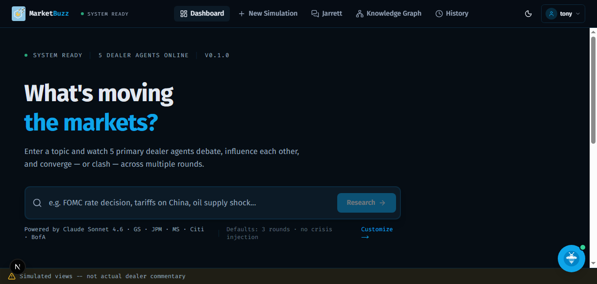
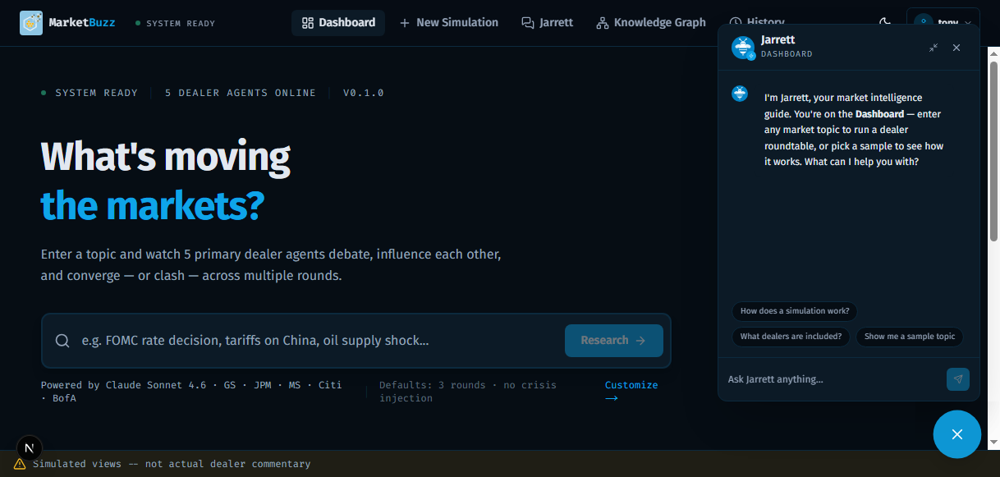
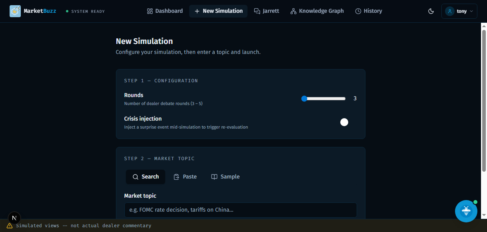
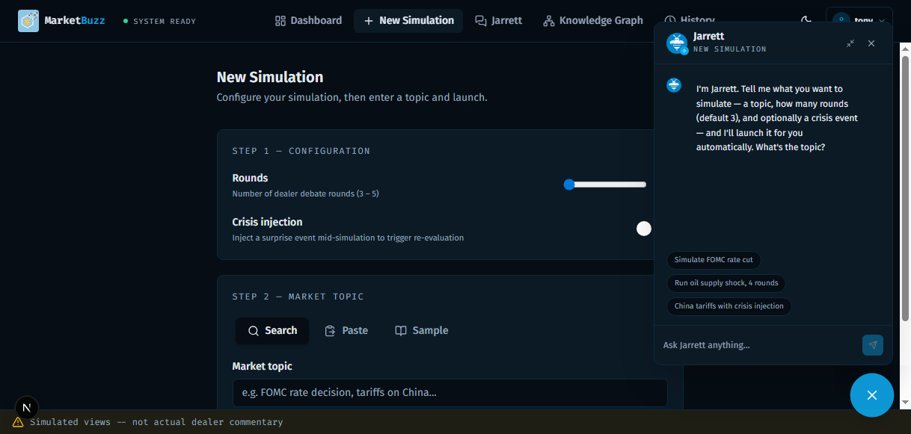
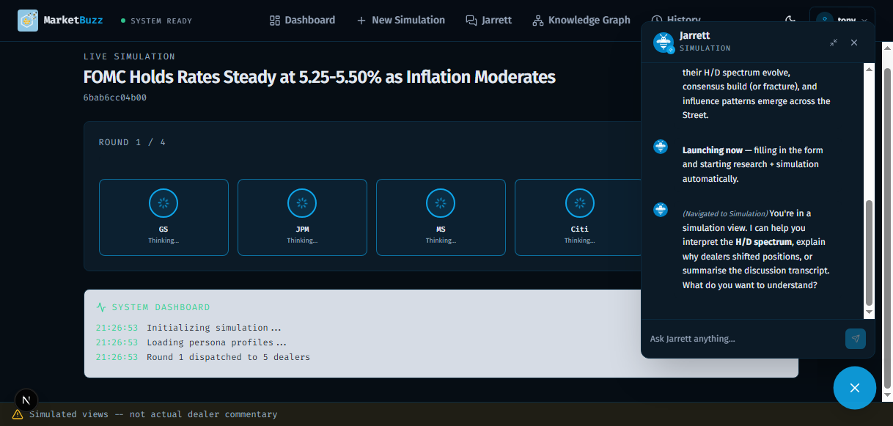

# MarketBuzz

**Multi-agent market intelligence platform.** Enter any macro event — FOMC rate decision, tariff shock, geopolitical crisis — and watch five primary dealer AI agents debate it in real time.



---

## What It Does

MarketBuzz simulates how the five largest US Treasury primary dealers react to market events. Each dealer (Goldman Sachs, JP Morgan, Morgan Stanley, Citi, Bank of America) is modelled with its publicly documented analytical framework, voice characteristics, and historical biases. They don't just respond once — they debate across multiple rounds, read each other's positions, and shift when persuaded.

The result is a structured picture of where the Street sits on any given event: who's hawkish, who's dovish, who's anchoring consensus, and who's the swing voter.

### Key Features

**Jarrett — your market intelligence guide**

Jarrett is a context-aware AI assistant that lives in every page of the console. Ask it to explain results, compare dealer views, or launch a simulation directly from the chat. It knows what page you're on, what simulations you've run, and can drive the app — navigating to the Knowledge Graph and applying analysis automatically.



**New Simulation — research + launch in one step**

Enter a topic or pick a sample event. The system searches live web sources, synthesises an event brief, and kicks off the multi-round dealer simulation. Tell Jarrett what you want to simulate and it fills the form and launches automatically.





**Simulation results — H/D spectrum, position evolution, transcript**

Each completed simulation shows:
- **H/D Spectrum** — where each dealer landed on the hawkish/dovish axis (-1.0 to +1.0)
- **Position Evolution** — how each dealer's view shifted round by round
- **Dealer Table** — per-dealer key quotes, confidence scores, and concerns
- **Discussion Transcript** — the full multi-round debate narrative



**Knowledge Graph**

A force-directed graph of dealer influence networks, shared concerns, and topic correlations built across all simulations. Jarrett can query it directly — ask it to "show the shortest path from GS to MS" or "highlight the most central nodes" and it navigates and applies the analysis automatically.

**Simulation History**

All past soundings with consensus scores, trajectory sparklines, and re-run capability.

---

## Stack

| Layer | Technology |
|-------|-----------|
| Frontend | Next.js 15 (static export), Tailwind CSS 4, shadcn/ui, D3.js, Motion |
| Backend | AWS Lambda (Node.js 20), Step Functions, API Gateway REST, DynamoDB, S3, CloudFront |
| AI | AWS Bedrock (Claude Sonnet 4.6 + Haiku 4.5), multi-agent dealer personas |
| Research | Tavily Search API (live web sources) |
| Infrastructure | Terraform |

---

## Project Structure

```
.
├── backend/          Lambda functions, shared lib, persona profiles, sample events
│   ├── lambdas/      auth, chat-agent, research, simulation (init/kickoff/write-round/complete/crisis)
│   │                 graph-builder, graph-reader, dealer-agent
│   ├── lib/          auth-middleware, DynamoDB helpers, secrets, convergence
│   └── data/         5 dealer persona profiles + sample events
├── frontend/         Next.js 15 app (static export)
│   └── src/
│       ├── app/      console (dashboard, sounding, graph, history), auth, landing
│       └── components/ Jarrett widget, viz components (D3), UI primitives
├── terraform/        Infrastructure modules + environment configs
└── docs/             Sample NY Fed survey results, specs, implementation guides
```

---

## Prerequisites

- AWS account with credentials configured (`aws configure` or AWS SSO)
- Terraform >= 1.5
- Node.js >= 20
- Tavily API key ([free tier: 1,000 searches/month](https://tavily.com))

---

## Local Development

### Backend

Copy the example env file and add your Tavily key:

```bash
cd backend
cp .env.local.example .env.local   # add TAVILY_API_KEY=tvly-...
npm install
node local-server.js               # runs all Lambda endpoints in-process on :3001
```

### Frontend

```bash
cd frontend
npm install
npm run dev   # http://localhost:3000
```

The frontend reads `NEXT_PUBLIC_API_URL` (defaults to `http://localhost:3001` for local dev).

---

## Deployment

Three stages: infrastructure → Lambda code → frontend.

### 1. Deploy Infrastructure (Terraform)

```bash
cd terraform
terraform init
terraform plan -var-file=environments/dev.tfvars
terraform apply -var-file=environments/dev.tfvars
```

Creates: 7 DynamoDB tables, S3 buckets, CloudFront, API Gateway, 9 Lambda functions, Step Functions state machine, Secrets Manager secrets, IAM roles.

Capture outputs after apply:

```bash
terraform output api_gateway_url       # → NEXT_PUBLIC_API_URL
terraform output cloudfront_url        # public URL
terraform output frontend_bucket_name  # S3 bucket for frontend
```

### 2. Set Tavily API Key

```bash
aws secretsmanager update-secret \
  --secret-id marketsounding-dev/tavily-api-key \
  --secret-string "YOUR_TAVILY_API_KEY"
```

### 3. Deploy Lambda Code

```bash
cd backend
npm run build
cd dist/lambdas/auth && zip -r ../../../auth.zip . && cd ../../..
aws lambda update-function-code \
  --function-name marketsounding-dev-auth \
  --zip-file fileb://auth.zip
```

Repeat for: `auth`, `research`, `simulation-kickoff`, `dealer-agent`, `write-round`, `init-simulation`, `complete-simulation`, `graph-builder`, `graph-reader`.

Or use the helper: `backend/scripts/deploy-lambdas.sh`.

### 4. Deploy Frontend

```bash
cd frontend
export NEXT_PUBLIC_API_URL="https://YOUR_API_GATEWAY_URL/v1"
npm run build
aws s3 sync out/ s3://YOUR_FRONTEND_BUCKET --delete
aws cloudfront create-invalidation \
  --distribution-id YOUR_DISTRIBUTION_ID \
  --paths "/*"
```

---

## API Endpoints

All routes require `Authorization: Bearer <jwt>` except where noted.

| Method | Path | Auth | Description |
|--------|------|------|-------------|
| POST | `/auth/register` | No | Register new user |
| POST | `/auth/login` | No | Log in, returns JWT |
| GET | `/events/samples` | No | 3 pre-configured sample events |
| POST | `/events/research` | Yes | Topic → web search → event brief |
| POST | `/simulations` | Yes | Start a new simulation |
| GET | `/simulations` | Yes | List user's simulations |
| GET | `/simulations/{id}` | Yes | Get simulation with all rounds |
| POST | `/simulations/{id}/crisis` | Yes | Inject crisis event mid-simulation |
| GET | `/personas` | No | List 5 dealer personas |
| GET | `/graph/subgraph` | Yes | Full knowledge graph |
| GET | `/graph/nodes/{id}` | Yes | Node detail + connected edges |
| POST | `/graph/rebuild` | Yes | Trigger full graph rebuild |
| POST | `/chat/{personaId}` | Yes | Chat with Jarrett or a specific dealer |

---

## Environment Variables

### Frontend

| Variable | Description |
|----------|-------------|
| `NEXT_PUBLIC_API_URL` | API Gateway base URL |

### Backend (set by Terraform per Lambda)

| Variable | Description |
|----------|-------------|
| `*_TABLE_NAME` | DynamoDB table names |
| `DOCUMENTS_BUCKET_NAME` | S3 bucket for transcripts and graph cache |
| `STATE_MACHINE_ARN` | Step Functions ARN (kickoff Lambda) |
| `JWT_SECRET_ARN` | Secrets Manager ARN for JWT signing key |
| `TAVILY_API_KEY_ARN` | Secrets Manager ARN for Tavily key |
| `BEDROCK_SONNET_MODEL_ID` | Claude Sonnet model ID |
| `BEDROCK_HAIKU_MODEL_ID` | Claude Haiku model ID |
| `CHAT_MODEL_ID` | Model used for Jarrett chat (default: Haiku) |

---

## Disclaimer

All dealer reactions are AI-simulated. They are not statements, opinions, or commentary from actual primary dealers. Persona profiles are constructed from publicly documented house views and analytical frameworks. This system is for analytical and educational exercise only — not for trading decisions or market-moving distribution.
